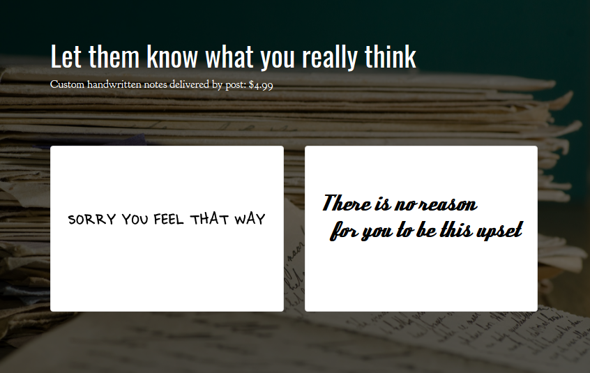

# SorryYouFeelThatWay.biz

## Premise

The non-apology has become a staple of contemporary discourse. SorryYouFeelThatWay.biz is a service that provides a new 
format for expressing defensive sentiments with the trappings of archaic civility. Simply select a design provide us with a custom message, signature, and a shipping address. We will hand write the message on a physical greeting card, sign it on your behalf, and mail it. 

## Live

[http://sorryyoufeelthatway.biz]

## Tech Stack

* Ruby (2.3.1)
* Rails (5.1.3)
* Bootstrap
* Stripe API

## Next Steps

* Add Admin section from previous iteration 
* Activate live Stripe account
* Refactor styling
* Add product photos
* Add support page

## Licensing

This project is licensed under [MIT license](./LICENSE)
